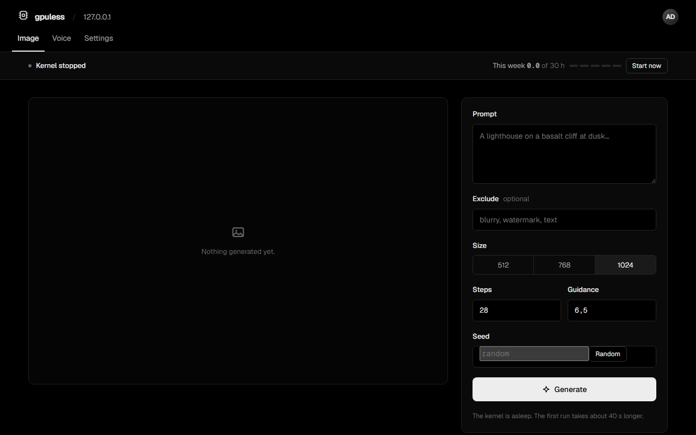
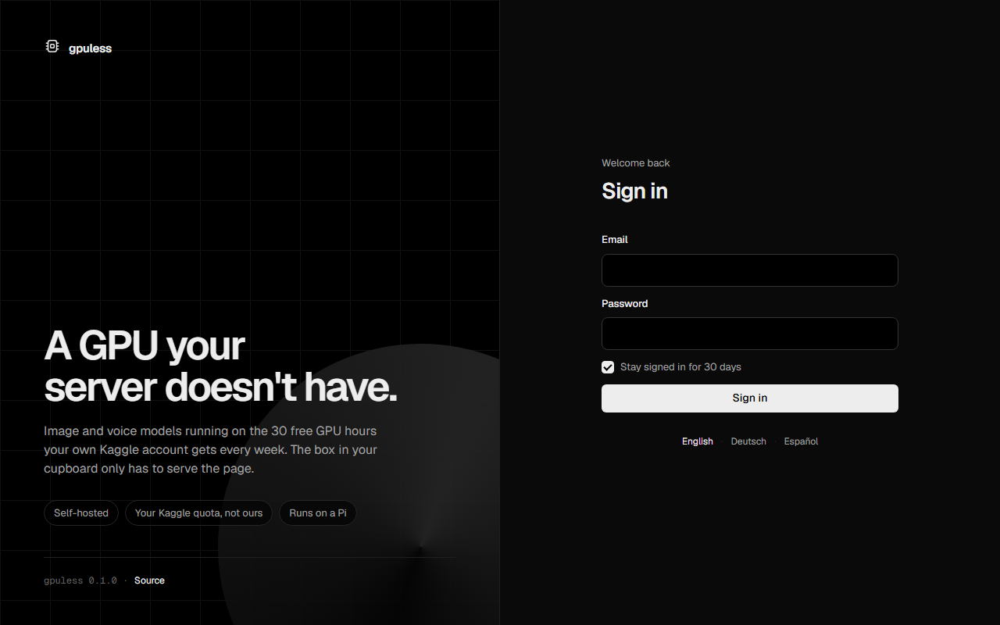
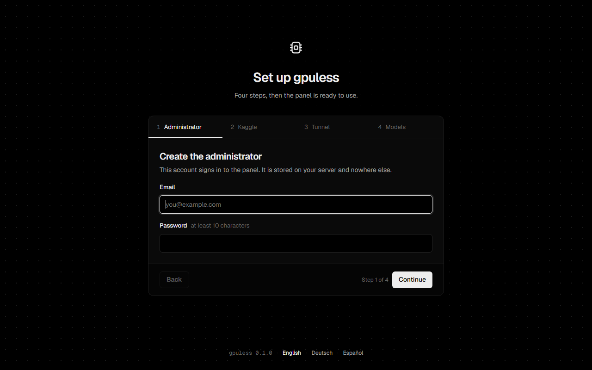
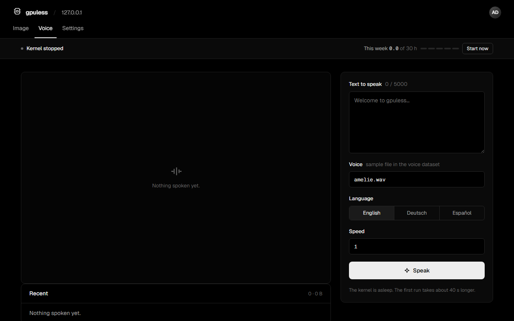
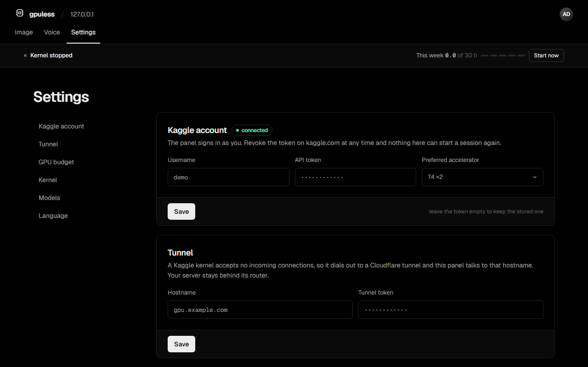

# GPUless

GPUless is a small, self-hosted panel that runs image and voice models on the free GPU hours of your own
[Kaggle](https://www.kaggle.com) account, 30 hours a week at the time of writing. The server it runs on needs no
graphics card: a mini PC or a Raspberry Pi is enough, because all it does is serve the page and drive the remote
kernel. It ships as a single Docker image and stores everything in one SQLite file.

Nothing is routed through anybody else's account. Every installation brings its own Kaggle credentials and spends
its own quota.



| Sign in | Setup wizard |
|---|---|
|  |  |

## Contents

- [Features](#features)
- [How it works](#how-it-works)
- [What Kaggle does and does not allow](#what-kaggle-does-and-does-not-allow)
- [Requirements](#requirements)
- [Installation](#installation)
- [The runtime dataset](#the-runtime-dataset)
- [Budget and the kernel lifecycle](#budget-and-the-kernel-lifecycle)
- [Workflows](#workflows)
- [Panel](#panel)
- [Configuration](#configuration)
- [Security](#security)
- [Checking the Kaggle API](#checking-the-kaggle-api)
- [Backup and updates](#backup-and-updates)
- [Building from source](#building-from-source)
- [Limitations](#limitations)
- [Roadmap](#roadmap)

## Features

- **Image generation** with Stable Diffusion XL through ComfyUI: prompt, negative prompt, size, steps and seed.
- **Text to speech** with XTTS v2, including the choice of speaker and language.
- **Your own Kaggle account.** The panel pushes a private notebook with the official API and spends only your quota.
- **Automatic start and stop.** The kernel starts on demand and stops itself after a few idle minutes.
- **Budget control.** The panel counts billed GPU time, warns at a set percentage and refuses new runs before the
  weekly allowance runs out.
- **Cold start hidden** behind page load: the kernel can warm up as soon as you open the panel.
- **History** of every image and voice run, with the result, its settings and the time it cost.
- **Replaceable workflows.** Generation runs on ordinary ComfyUI graphs; drop in your own without a rebuild.
- **Setup wizard** for the administrator, Kaggle, the tunnel and the model datasets. It can be resumed.
- **English, German and Spanish.** Choose a language or follow the visitor's browser.
- **Small and self-contained.** One static binary, no GPU on the server, no requests to anyone but Kaggle and your
  own tunnel.

## How it works

```
     your server (no GPU)                         Kaggle (free GPU)
 +---------------------------+              +----------------------------+
 |  browser -> gpuless panel |              |  runner notebook           |
 |             |             |              |   |- ComfyUI     :8188     |
 |             |  kernels/push ------------>|   |- edge        :8189     |
 |             |             |              |   '- cloudflared ---+      |
 |             '-- HTTPS ----+--------------+-- gpu.example.com <-+      |
 +---------------------------+              +----------------------------+
```

1. The panel pushes a private notebook to your Kaggle account through the official API. Pushing a version is what
   runs it.
2. The notebook starts ComfyUI, puts a small authenticating edge in front of it and dials out to your Cloudflare
   tunnel.
3. The panel reaches ComfyUI through that hostname, queues a workflow and downloads the result.
4. When nothing has been asked of it for a few minutes, the kernel stops itself and the weekly clock stops with it.

## What Kaggle does and does not allow

These constraints shaped the design, and it is worth knowing them before you start:

- **Kaggle runs its own notebook image.** You cannot hand it a container. The ComfyUI runtime therefore ships as a
  dataset that gets mounted, not as an image that gets pulled. See [the runtime dataset](#the-runtime-dataset).
- **A kernel accepts no incoming connections.** It has to dial out, which is why a tunnel is required.
- **There is no API to stop a running kernel.** The runner script watches its own idle time and exits. The panel's
  **Stop now** button asks that script to exit.
- **There is no API for the quota you have left.** Kaggle shows the figure only on its website. GPUless counts the
  hours itself, and hours you spend on kaggle.com directly are not in that number.

## Requirements

- A machine that can run one small container. A Raspberry Pi 4 is plenty.
- A **Kaggle account**, verified for GPU use (phone verification), and an API token.
- A **Cloudflare tunnel** with a public hostname. The free plan is enough, and it needs no open port on your side.
- One Kaggle dataset with the ComfyUI runtime, plus one dataset per model.

## Installation

### 1. Start the container

Create `/opt/gpuless/docker-compose.yml`:

```yaml
services:
  gpuless:
    image: ghcr.io/johanneshehl/gpuless:latest
    container_name: gpuless
    restart: unless-stopped
    ports:
      - "8080:8080"
    volumes:
      - ./data:/data
      - ./workflows:/workflows:ro
    environment:
      GPULESS_WORKFLOWS: /workflows
```

The image runs as the unprivileged user `10001`, which needs to own the data directory:

```
mkdir -p /opt/gpuless/data /opt/gpuless/workflows
sudo chown 10001:10001 /opt/gpuless/data
cd /opt/gpuless
docker compose up -d
```

### 2. Put a reverse proxy in front

To reach the panel from outside your network, put a reverse proxy with HTTPS in front of it, bind the port to
localhost (`127.0.0.1:8080:8080`) and set `GPULESS_BEHIND_PROXY=1`. For Caddy:

```
gpuless.example.com {
	reverse_proxy 127.0.0.1:8080
}
```

The setup wizard is open to anyone until it is finished. Complete it before the panel is reachable from the
internet, or put a login gate such as [Wicket](https://github.com/johanneshehl/Wicket) in front of it.

### 3. Run the setup wizard

Open the panel in your browser. The wizard has four steps, and whatever it already accepted is kept if you close
the tab:

1. **Administrator.** The account that signs in to the panel.
2. **Kaggle.** Your Kaggle username (the name in your profile address, `kaggle.com/<name>`) and an API token from
   *kaggle.com > Settings > API Tokens > Generate New Token* (it starts with `KGAT_`), and the accelerator you
   prefer. A legacy key from `kaggle.json` works as well. The panel checks the credentials with Kaggle before
   moving on.
3. **Tunnel.** The public hostname and the tunnel token from *one.dash.cloudflare.com > Networks > Tunnels*. Route
   the hostname to `http://localhost:8189`, which is the runner's edge, not ComfyUI itself.
4. **Models.** The dataset references, in the form `owner/slug`. The runtime dataset is required; leave a model
   empty to hide its tab.

## The runtime dataset

Kaggle cannot pull your container, so ComfyUI and its dependencies are mounted from a dataset on your account.
[`docs/runtime-dataset.md`](docs/runtime-dataset.md) walks through building one. It holds:

```
ComfyUI/            the checkout, with its custom nodes
site-packages/      anything the Kaggle image does not already have
bin/cloudflared     the tunnel client
```

Model weights live in their own datasets and are mounted into ComfyUI's model folders, so a cold start costs
seconds of mounting rather than minutes of downloading.

| Panel setting | ComfyUI folder | Contents |
|---|---|---|
| Runtime | | ComfyUI, extra Python packages, cloudflared |
| Image model | `checkpoints` | `sd_xl_base_1.0.safetensors` or similar |
| Voice model | `tts` | XTTS v2 weights and a speaker sample |

## Budget and the kernel lifecycle

A Kaggle session spends the weekly allowance from the moment it is allocated, whether or not anything is being
generated. Idle time is the biggest way to waste it, so the defaults are frugal:

| Setting | Default | Why |
|---|---|---|
| Stop when idle | 5 minutes | Kaggle's own cut-off is 20 minutes. Stopping sooner keeps the difference. |
| Warm up on first visit | on | Hides the cold start behind the time it takes to read the page. |
| Keep alive while a tab is open | off | A tab left open overnight can cost most of a week. |
| Hard session limit | 9 hours | A backstop for a kernel that never goes idle. |
| Warn at | 80 % | Shown in the status line. |
| Refuse new runs at | 98 % | Leaves a margin rather than running the account dry. |

Both sides enforce the idle stop: the runner script exits on its own, and the panel checks as a backstop. A cold
start after an automatic stop takes about 40 seconds.

The panel counts billed time from the moment it asks Kaggle for a session, not from the moment ComfyUI answers,
because the cold start is billed too. A kernel that outlives a panel restart is picked up again rather than left
running unwatched.

## Workflows

Generation runs on ordinary ComfyUI graphs in API format. The built-in ones are in `web/workflows/`, and each
carries a small `_gpuless` block that says how to fill it in:

```json
{
  "_gpuless": {
    "output_nodes": ["9"],
    "bind": { "prompt": ["6", "text"], "steps": ["3", "steps"] }
  },
  "6": { "class_type": "CLIPTextEncode", "inputs": { "text": "" } }
}
```

Put a replacement `image.json` or `voice.json` into the directory named by `GPULESS_WORKFLOWS` and the panel uses
it instead, without a rebuild. This matters most for voice: text to speech is not part of ComfyUI, so the default
graph targets an XTTS node pack, and class names differ between packs. A broken override fails at start-up with
the file name, not silently at the first run.

## Panel

The status line under the tabs shows the kernel state (stopped, starting, running, idle countdown), the GPU hours
used this week and when the count resets.

### Image

Prompt, negative prompt, size, steps and seed. Results appear in the history below, with the settings they were
made with.

### Voice

Text, speaker and language. The result can be played in the browser and downloaded.



### Settings

Kaggle account and accelerator, tunnel, idle stop, warm-up and keep-alive, session limit, weekly quota with warning
and refusal thresholds, model datasets and language.



## Configuration

Flags, or the matching environment variables:

| Flag | Variable | Default | Description |
|---|---|---|---|
| `-addr` | `GPULESS_ADDR` | `:8080` | Address the panel listens on. |
| `-data` | `GPULESS_DATA` | `./data` (`/data` in the image) | Directory for the database and generated media. |
| `-workflows` | `GPULESS_WORKFLOWS` | | Directory with workflow overrides. |
| `-behind-proxy` | `GPULESS_BEHIND_PROXY=1` | off | Trust `X-Forwarded-For` and `X-Forwarded-Proto`. Only set this behind a reverse proxy. |
| `-log` | `GPULESS_LOG` | `text` | Log format, `text` or `json`. |
| `-check-kaggle` | | | Check the Kaggle API with your credentials and exit. |
| `-version` | | | Print the version and exit. |

Everything else is set in the panel and stored in the database, so a new container on the same volume comes back
identical.

## Security

- Passwords are hashed with bcrypt at cost 12. Session tokens are random 256-bit values; only their SHA-256 hash is
  stored, so a copied database hands over no live sessions.
- Repeated failed sign-ins lock an address out for 15 minutes.
- The tunnel hostname is public, so every request to the kernel carries a 256-bit secret that the panel generates
  and the runner checks. Without it the edge answers `401` and nothing reaches ComfyUI.
- The runner notebook contains the tunnel token and that secret, so it is always pushed private.
- The setup endpoints close once setup is finished; afterwards they need a session.
- Responses carry a strict Content Security Policy. The panel loads no third-party scripts and makes no requests
  other than to Kaggle and your own tunnel; fonts are bundled.
- The image is based on Alpine and runs as a non-root user.

## Checking the Kaggle API

The Kaggle client is tested against fakes. To check it against your own account:

```
docker exec -e KAGGLE_USERNAME=<user> -e KAGGLE_KEY=<token> gpuless gpuless -check-kaggle
```

Without the variables it reads `~/.kaggle/kaggle.json` or the credentials of a panel that is already set up. It
runs the four calls the panel depends on (authenticate, push, status, read the log) and prints what each one did.
The notebook it pushes is private, CPU-only and has no internet access, so it costs no GPU time. Your token never
appears in the output. Delete the `gpuless-apicheck` notebook afterwards if you like a tidy account.

## Backup and updates

The database and the generated images and audio are in the data directory. To back it up, copy the directory,
ideally while the container is stopped:

```
docker compose stop gpuless
cp -a /opt/gpuless/data /backup/gpuless-$(date +%F)
docker compose start gpuless
```

To update to the latest version:

```
docker compose pull
docker compose up -d
```

## Building from source

Requirements: Go 1.24 or Docker.

```
docker build -t gpuless .
```

Or without Docker:

```
go test ./...
CGO_ENABLED=0 go build -o gpuless .
./gpuless -data ./data
```

There is no build step for the front end and no CGO: the SQLite driver is pure Go, so the result is one static
binary.

Releases are built by GitHub Actions: pushing a tag like `v0.1.0` publishes the image for `linux/amd64` and
`linux/arm64` to `ghcr.io/johanneshehl/gpuless` and creates a GitHub release.

## Limitations

- **The quota figure is an estimate.** It is the panel's own tally and cannot see hours you spend on kaggle.com.
- **A cold start takes about 40 seconds.** Kaggle has no standby that pauses the clock while a kernel stays warm.
- **The voice workflow depends on a node pack** that is not part of ComfyUI. If yours uses different class names,
  override the graph.
- **One kernel at a time.** Two people generating at once queue behind each other inside ComfyUI.
- **Kaggle may assign a different accelerator** than the one you asked for. The panel shows what the kernel
  actually reports.

## Roadmap

Planned for upcoming versions:

- **Setup code** printed to the container log, so the wizard is safe on a public host.
- **Upscaling and image-to-image** on the Image tab.
- **Voice cloning** from an uploaded sample.
- **Tailscale** as an alternative to the Cloudflare tunnel.
- **A second user role** that can generate but not change settings.
- **Prometheus metrics** for kernel time and runs.

## Acknowledgements

GPUless uses [ComfyUI](https://github.com/comfyanonymous/ComfyUI), the [Geist](https://vercel.com/font) typeface
(SIL Open Font License 1.1), [modernc.org/sqlite](https://gitlab.com/cznic/sqlite) and
[golang.org/x/crypto](https://pkg.go.dev/golang.org/x/crypto). The interface shares its visual system with
[Wicket](https://github.com/johanneshehl/Wicket).
